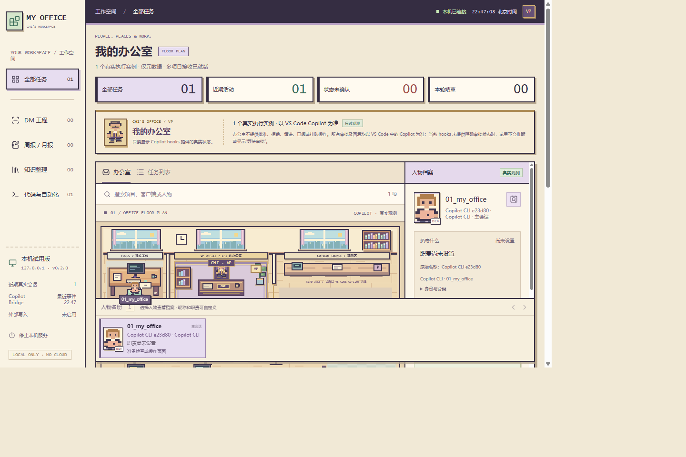
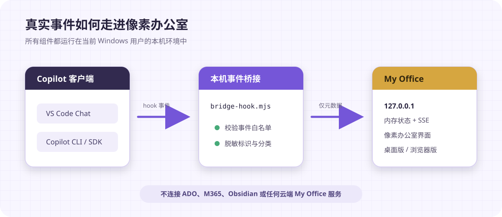
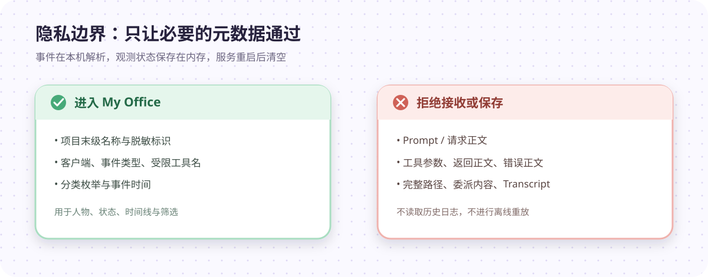

<div align="center">

# My Office

**把 Copilot Agent 的真实工作状态，变成一间看得见的像素办公室。**

本机运行 · 仅元数据 · 只读观测 · Windows 桌面版 / 浏览器版

</div>



> 当前版本：`v0.2.0`
>
> 当前状态：已验证 VS Code 内置 Copilot CLI / SDK 的真实事件接入；传统 VS Code Chat、独立终端 CLI 和远程开发环境仍需分别验证。

## My Office 是什么？

My Office 是一个面向个人工作流的本机 Copilot 可视化工具。它把 VS Code Chat、Copilot CLI / SDK 通过 hooks 发出的事件，映射成像素办公室中的人物、位置、状态和时间线。

你可以用它回答这些问题：

- 现在有几个 Copilot 会话正在活动？
- 哪个 Agent 正在搜索、修改文件或操作页面？
- 这个会话来自哪个本机项目、哪个客户端？
- 当前观察到的是“准备调用工具”“工具已返回”，还是“本轮结束”？
- 哪些状态有真实事件依据，哪些状态暂时无法确认？

My Office **不是 Agent 调度器，也不是审批中心**。批准、拒绝、追问和继续执行仍然在原 Copilot 界面完成。

## 设计原则

| 原则 | 说明 |
|---|---|
| 真实事件 | 只展示 Copilot hooks 实际发送的事件，不生成演示员工，不推测任务进度 |
| 仅元数据 | 不采集 Prompt、工具参数、返回正文、错误正文或 Transcript |
| 本机优先 | 服务只监听 `127.0.0.1`，不依赖云端 My Office 服务 |
| 证据优先 | hooks 没有提供的审批、权限和完成状态，界面明确显示“无法确认” |
| 只读观测 | 办公室不向 Copilot 写回审批结果，也不改变 Agent 权限 |

## 工作原理



1. VS Code Chat 或 Copilot CLI / SDK 触发原生 hook 事件。
2. `bridge-hook.mjs` 从标准输入读取事件，在本机完成校验、脱敏和规则分类。
3. 桥接器只把允许的元数据发送到 `127.0.0.1` 上的 My Office 服务。
4. 服务在内存中维护执行实例和时间线，通过 SSE 更新桌面版或浏览器版界面。
5. 服务退出后，内存中的观测记录清空；收到新事件后重新建立人物状态。

## 隐私边界



### 会进入 My Office

- 项目目录的末级名称
- 工作区、会话和子 Agent 的 SHA-256 脱敏标识
- 客户端类型、事件类型、受限工具名和事件时间
- 在 hook 进程内计算出的任务分类枚举

### 不会进入 My Office

- Prompt、请求正文或请求摘录
- 工具参数、工具返回正文和错误正文
- 完整项目路径、委派内容和 Transcript 路径
- 历史聊天、离线日志或外部系统数据

接收端使用字段白名单拒绝正文和原始路径。My Office 不连接 ADO、Microsoft 365、Obsidian、外部模型、CDN 或遥测服务。

> [!IMPORTANT]
> 运行时会在 `app/.local` 下生成包含本机地址和桥接令牌的描述文件。该目录已被 Git 忽略，请不要分享、提交、截图或同步其中的内容。

## 快速开始

### 方式一：Windows 桌面版

双击 [`desktop/My Office.exe`](desktop/My%20Office.exe)，或运行：

```powershell
.\start-desktop.cmd
```

桌面版使用 Electron 打开独立窗口，不显示浏览器地址栏。它会复用已验证的 My Office 服务，或启动自己的本机服务：

- 重复打开时只唤起已有桌面窗口。
- 如果服务由桌面版启动，关闭窗口时会同时停止该服务。
- 如果连接的是外部已运行服务，关闭窗口不会停止外部服务。
- 当前便携程序未签名，不需要管理员权限，不安装系统服务，也不设置开机自启。

当前构建绑定本仓库位置。移动 EXE 不影响使用，但移动或删除仓库后需要重新生成 hooks 并重新构建。

### 方式二：浏览器版

运行：

```powershell
.\start.cmd
```

也可以直接启动 Node.js 服务：

```powershell
node .\app\src\server.mjs
```

默认地址为 <http://127.0.0.1:19000>。如果 19000 已被占用，启动器会在后续 20 个本机端口中选择可用端口，不会结束占用端口的其他进程。

停止服务：

- 在页面左侧选择“停止本机服务”并确认；或
- 在启动服务的终端中按 `Ctrl+C`。

## 配置 Copilot hooks

仓库提供两套示例，分别对应不同客户端：

| 客户端 | 示例文件 | 配置位置 |
|---|---|---|
| 传统 VS Code Chat | [`app/hooks/my-office.hooks.example.json`](app/hooks/my-office.hooks.example.json) | `chat.hookFilesLocations` |
| Copilot CLI / SDK | [`app/hooks/copilot-cli.hooks.example.json`](app/hooks/copilot-cli.hooks.example.json) | `%USERPROFILE%\.copilot\settings.json` 中的 `hooks` |

两套配置最终调用同一个 [`app/src/bridge-hook.mjs`](app/src/bridge-hook.mjs)，不要把两套 hooks 重复安装到同一客户端。

### 1. 生成当前路径对应的配置

在仓库根目录运行：

```powershell
npm.cmd --prefix .\app run generate:hooks
```

生成结果位于：

```text
app\.local\generated-hooks\vscode-hooks.json
app\.local\generated-hooks\copilot-cli-hooks.json
```

该命令**只生成文件，不会自动修改用户设置**。应用前请检查内容，并保留用户已有的其他 hooks、权限和组织策略。

### 2. 配置传统 VS Code Chat

VS Code 用户设置中的路径应使用用户目录形式：

```json
{
  "chat.hookFilesLocations": {
    "~/.copilot/my-office/vscode-hooks.json": true
  }
}
```

本机 VS Code 的 hooks 路径校验器不接受盘符绝对路径或反斜杠。`chat.hookFilesLocations` 的键使用 `~/` 路径，与 hook 命令内部调用 Windows 绝对脚本路径并不冲突。

### 3. 配置 Copilot CLI / SDK

把生成文件中的 `hooks` 合并到：

```text
%USERPROFILE%\.copilot\settings.json
```

如果设置了 `COPILOT_HOME`，请先确认实际配置目录。不要覆盖已有设置，也不要再把同一组观察 hooks 放进传统 Chat 会共同扫描的位置。

### 4. 用真实事件验收

1. 启动 My Office，确认左下角显示 `v0.2.0`，Bridge 状态为“就绪 · 等待事件”。
2. 新建 Copilot Agent 会话。
3. 发送一个只读任务，例如：

   > 只读检查当前项目的目录结构，概括主要文件的用途。不要修改文件、安装依赖或访问外部系统。

4. 检查办公室是否出现对应项目、客户端、工具名和事件时间。
5. 等执行结束后，界面应显示“本轮结束”，而不是“已完成”或“等待审批”。
6. 再新建一个会话，确认两个执行实例独立显示。

“Bridge 就绪”只代表接收端已经启动，不代表当前 Copilot 客户端一定触发了 hook。应以真实事件投递作为最终验收标准。

## 你会在界面中看到什么？

### 像素办公室

- 最多在场景中显示六个真实执行实例。
- 固定的 `Chi · VP` 是办公室主人角色，不属于 Agent，也不计入任务统计。
- 人物位置和状态只由真实事件决定，不根据时间或工具次数伪造进度。
- 所有筛选结果都可在底部人物名册和任务列表中查看。

### 人物档案

选择人物后可以查看：

1. **身份与来源**：项目、客户端、主会话或子 Agent。
2. **任务分类**：DM 工程、周报 / 月报、知识整理、代码与自动化。
3. **最近操作**：把工具事件解释为可读状态，同时保留实际工具名。
4. **是否需要处理**：当 hooks 没有提供足够证据时，引导回原 Copilot 界面确认。
5. **最近记录**：展示该执行实例最近收到的真实事件。

### 自定义人物介绍

可以为人物设置昵称和职责：

- 仅昵称和职责保存在当前浏览器的 `localStorage`。
- 数据按“来源 + 执行实例 ID”关联，不会修改真实 Agent 的角色、提示词或权限。
- 不同浏览器、端口、`localhost` 与 `127.0.0.1` 之间不会自动共享。
- 最多保存 500 份介绍，可恢复单个人物默认值或清除全部本机人物介绍。

## 已知限制

- 当前已真实验收 VS Code 内置 Copilot CLI / SDK 的跨项目事件。
- 传统 VS Code Chat、独立终端 CLI、其他配置档、WSL、SSH、容器和网络共享尚未完整验证。
- CLI 的部分内置 Agent 不发送独立子 Agent 事件，因此并非所有子任务都能显示为单独人物。
- hooks 没有提供完整的权限、提问和审核状态；My Office 不会猜测是否正在等待你处理。
- `Stop`、`SubagentStop` 和 `SessionEnd` 只表示“本轮结束”，不等于任务成果已验证。
- 真实会话没有独立心跳。超过 5 分钟没有新事件时显示“状态未确认”，不等于离线。
- 时间线最多保留 300 条内存事件；它不是可靠消息队列，不补发已丢失的事件。
- 页面按完整快照更新，慢连接会跳过中间快照并在可发送时使用最新状态。
- 当前工具面向同一 Windows 用户，不声称防御具有相同用户权限的恶意进程，也不构成组织安全审批结论。

## 开发

### 环境要求

- Windows
- Node.js 24 或更新版本

### 安装与运行

```powershell
npm.cmd --prefix .\app ci --ignore-scripts --no-audit --no-fund
npm.cmd --prefix .\app start
```

### 运行测试

```powershell
npm.cmd --prefix .\app test
```

项目后端使用 Node.js 内置 HTTP、SSE 和 `node:test`；前端使用原生 ES modules、Canvas 2D、HTML 和 CSS。

### 运行 Electron 开发版

```powershell
npm.cmd --prefix .\app run desktop
```

### 构建 Windows 便携版

```powershell
npm.cmd --prefix .\app run build:desktop
```

输出文件为 `desktop\My Office.exe`。便携包包含 Electron 运行时和界面，不包含任务文件、桥接令牌或浏览器数据。

## 项目结构

```text
my-office/
├─ app/
│  ├─ hooks/                 # VS Code Chat 与 Copilot CLI hooks 示例
│  ├─ public/                # HTML、CSS、Canvas 像素办公室和前端逻辑
│  ├─ scripts/               # hooks 生成与桌面构建准备脚本
│  ├─ src/                   # 本机服务、桥接器、启动器和 Electron 入口
│  └─ test/                  # 后端、前端契约与桌面版测试
├─ desktop/                  # Windows 便携版输出
├─ docs/images/              # README 截图与说明图
├─ start.cmd                 # 启动浏览器版
└─ start-desktop.cmd         # 启动桌面版
```

## 故障排查

### 页面显示“等待事件”

这通常说明服务正常，但客户端没有触发配置好的 hook。请检查：

- 当前会话实际由传统 Chat 还是 CLI / SDK 执行。
- VS Code 的 `/hooks` 是否加载了预期配置。
- CLI / SDK 的用户设置中是否存在对应的内联 hooks。
- 配置中的桥接脚本路径是否仍指向当前仓库。
- 是否新建了会话并触发了真实工具事件。

### 修改源码后页面没有变化

运行中的服务不会自动加载新源码。先停止原实例，再重新启动桌面版或浏览器版。

### 移动仓库后 hooks 失效

重新生成 hooks：

```powershell
npm.cmd --prefix .\app run generate:hooks
```

然后检查生成文件，并更新对应客户端配置。不要直接复制旧机器或旧目录中的绝对路径。

### 如何彻底停用？

停止 My Office 服务后，hooks 会正常退出但不再转发事件。彻底停用时，只移除指向 My Office 的 VS Code 配置项和 CLI hooks 条目，保留其他已有配置。

## 参考资料

- [VS Code Agent hooks](https://code.visualstudio.com/docs/agent-customization/hooks)
- [VS Code Hooks reference](https://code.visualstudio.com/docs/agents/reference/hooks-reference)
- [GitHub Copilot CLI hooks reference](https://docs.github.com/en/copilot/reference/hooks-reference)
- [`DEVELOPMENT_PLAN.md`](DEVELOPMENT_PLAN.md)

---

<div align="center">

**让 Agent 工作具象化，但不让观测越过隐私边界。**

</div>
